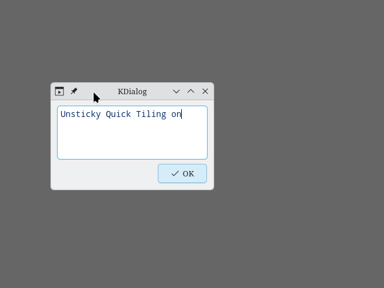
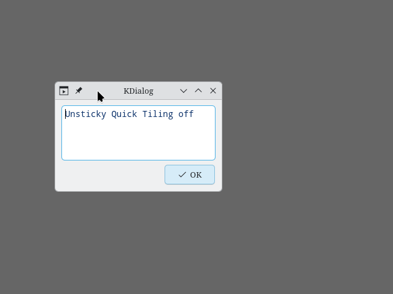

# Unsticky Quick Tiling KWin Script

Immediately untile a quick tiled window again while keeping the window size like the tile size.

When using KWin’s built-in quick tiling, then

- quick tiled windows stick together when you change the size of one quick tiled window, and
- when maximizing and restoring a quick tiled window, the window size will be the one before quick tiling.

This script works around these behaviors.

This script can also help making the behavior of other scripts that do not specially deal with quick tiled windows more consistent, for example Sticky Windows Snapping.

For comparison, this is the default behavior (without Unsticky Quick Tiling):

